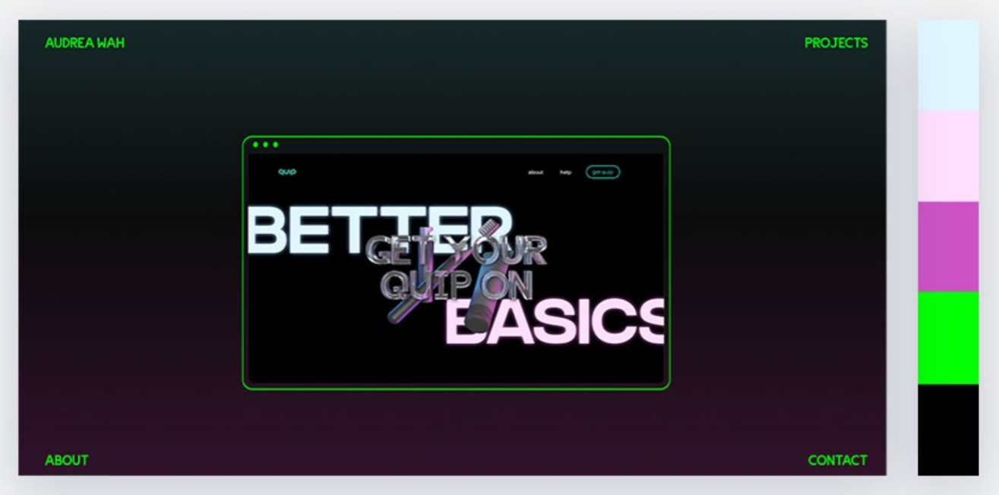

# Proyecto Editor de Memes

El editor de memes es el proyecto final del segundo módulo del curso Desarrollo Frontend de la organización [ADA ITW](https://adaitw.org/).
En esta ocasión, realizamos un **editor de memes** utilizando las tecnologías vistas a lo largo de los múdulos 1 y 2, que consisten en **HTML5, CSS3, JAVASCRIPT y GIT**

## Contenido

[Descripción](#Descripción)
[Gama de colores y fuentes tipográficas](#gama-de-colores)
<!-- [Muestra del proyecto](#muestra-del-proyecto) --> -->

## Descripción

Para la realización del proyecto editor de memes, se nos indico que nos basaramos en la siguiente muestra: [aquí](https://frontend-proyecto-meme.adaitw.org/). La funcionalidad tenía que ser igual a este modelo, sin embargo, con en el anterior proyecto, se nos permitió realizar modificaciones simples, sobre todo en el diseño visual del proyecto.
Como se podrá observar, las modificaciones en mi proyecto fueron en la paleta de colores, así como en el acomodo de los asides.

### Gama de colores y fuentes tipográficas

Para la paleta de colores tomé como referencia la siguiente imagen:

1. #dff6fe;
2. #ffdefd;
3. #ff2f9f;
4. #cfffc7;
5. #02ff04;
6. #000000;

Para la tipografía utilicé:
**Poppins** para títulos y subtítulos.
**Montserrat** para los textos en general.

